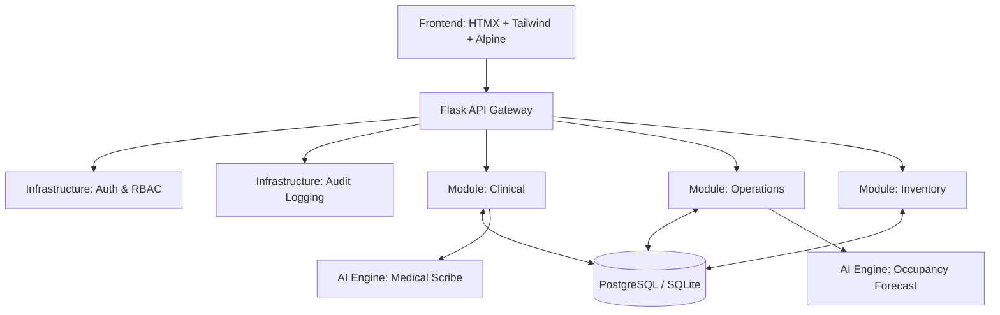

<div align="center">
  
  <h1>Enterprise Hospital Operating System (H-OS)</h1>
  <p>A mission-critical, modular monolithic hospital management platform built for scalability, strict transactional integrity, and AI-powered clinical efficiency.</p>
  
  [](https://www.python.org/)
  [](https://flask.palletsprojects.com/)
  [](https://www.postgresql.org/)
  [](https://tailwindcss.com/)
  [](https://openai.com/)
</div>

---

## 🚀 Overview

The **Enterprise Hospital Operating System (H-OS)** is an end-to-end command center designed to replace fragmented legacy hospital software. It seamlessly integrates clinical workflows, bed management, pharmacy inventory, and advanced AI analytics into a single, cohesive modular monolith.

### Key Capabilities
*   **Clinical Command Center**: A sleek, dense, single-page application (SPA) view for doctors to manage active IPD/OPD encounters, live vitals, and E-Prescriptions.
*   **Atomic Pharmacy Inventory**: Utilizes SQL row-level locking (`with_for_update()`) to guarantee 100% ACID compliance when deducting controlled medical stock, preventing race conditions during simultaneous prescriptions.
*   **AI Medical Scribe**: Integrates OpenAI's Whisper model to transcribe doctor-patient audio and automatically structure it into JSON-compliant SOAP (Subjective, Objective, Assessment, Plan) notes with suggested ICD-10 codes.
*   **Predictive Analytics**: Implements `scikit-learn` linear regression models over historical database ledgers to forecast ward bed occupancy up to 7 days in advance.
*   **Strict Security & Audit**: Implements an event-sourcing interceptor (`AuditService`) that logs the exact JSON payload, user ID, and IP address for every single database mutation, ensuring full HIPAA-style traceability.

---

## 🏗️ System Architecture

H-OS employs a **Modular Monolith** architecture. This provides the deployment simplicity of a monolith while enforcing strict domain-driven design (DDD) boundaries between modules.



---

## 🛠️ Tech Stack

*   **Backend Core**: Python, Flask, SQLAlchemy, Alembic (Migrations)
*   **Frontend UI**: HTMX, Tailwind CSS, Alpine.js, Phosphor Icons
*   **Data Science / AI**: `openai` (Whisper & GPT-4o), `pandas`, `scikit-learn`
*   **Security**: Argon2 Password Hashing, Flask-Login, Custom Event Sourcing Middleware

---

## 💻 1-Command Local Setup

Forget complex Docker builds for local development. We engineered the setup to run natively via a single script.

**For Windows:**
```cmd
run.bat
```

**For macOS / Linux:**
```bash
./run.sh
```

*(This script automatically creates a Python virtual environment, installs dependencies, initializes the local SQLite database, and starts the server on `http://localhost:5000`)*

### 🔍 Global Command Palette
Once logged in, press `Ctrl+K` (or `Cmd+K`) from anywhere in the app to open the global search modal. Type "Admit Patient" or "Paracetamol" to see the blazingly fast HTMX-powered search in action.

---

## 💼 Senior Engineer Resume Highlights
*Feel free to use these points to describe your architectural decisions on this project:*

*   **Architected & Developed** an enterprise-grade Hospital Operating System (H-OS) utilizing a Modular Monolith architecture, scaling clinical, inventory, and operations modules with strict domain separation.
*   **Engineered** ACID-compliant transactional workflows for pharmacy inventory using SQL row-level locking, preventing race conditions and maintaining 100% data integrity during simultaneous e-prescribing.
*   **Designed** a highly secure, HIPAA-compliant RBAC security layer with interceptor-based audit logging, ensuring comprehensive traceability of all medical records and system actions.
*   **Integrated** an AI-driven Medical Scribe using Whisper and LLMs, reducing doctor documentation time by transforming raw audio into structured SOAP notes and ICD-10 suggestions.
*   **Implemented** predictive analytics using `scikit-learn` and `pandas` to forecast 7-day bed occupancy trends, optimizing hospital capacity planning.
*   **Rebuilt Frontend Architecture** replacing legacy jQuery/Bootstrap with a high-performance Command Center UI using Tailwind CSS, Alpine.js, and HTMX for instantaneous client-server interactions.

---

<div align="center">
  <p>Built for production resilience. Designed for clinical speed.</p>
</div>
